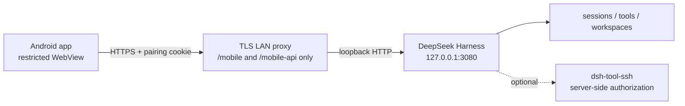

# DSH Mobile LAN

[简体中文](README.md) | English

Bring a restricted [DeepSeek Harness](https://github.com/deepseek-ai/deepseek-harness) chat surface to an Android phone on the same trusted LAN. Pair by scanning a short-lived QR code, then select sessions, send prompts, follow live output, inspect tool activity, and manage queued messages without configuring SSH on the phone or exposing Harness to the Internet.

> [!IMPORTANT]
> This is a community project, not an official DeepSeek release. The current version is designed for **one operator, trusted phones, and a trusted private network**. Do not expose port 3080, the TLS proxy, or `/mobile-api` to the public Internet.

<p align="center">
  
  
</p>

## Features

- Short-lived, single-use QR pairing generated only on the computer's loopback page.
- Up-to-seven-day HttpOnly device session, revoked early on logout or Harness restart.
- Session drawer, workspace grouping, optional desktop-session visibility, and a default workspace selector.
- Markdown, code blocks, compact links, message copy, and conversation forks.
- Live responses, collapsible tool/command timeline, completion notifications, and approval reminders.
- Running-turn queue editing, deletion, single-message steering, and steer-all.
- Permission preset, agent preset, model, and reasoning-effort controls.
- Light, dark, and system appearance modes.
- Optional SSH tool with server-side aliases, host-key pinning, exact command allowlists, and workdir allowlists.

## Architecture and trust boundary



- Harness remains bound to `127.0.0.1`. Do not use `--host 0.0.0.0` or `--trusted-host`.
- The TLS proxy rejects the desktop root UI, `/api`, unsupported methods, and WebSocket upgrades.
- `/mobile-pair` accepts only a loopback Host. The QR code never contains the long-lived environment secret.
- Android trusts only the installation-specific CA and still verifies the certificate SAN. TLS errors are never ignored.
- The WebView allows only `/mobile/` and `/mobile-api/` on the paired HTTPS origin.
- SSH credentials stay on the computer. The phone can request only aliases authorized by both plugins.

Read [the repository security policy](SECURITY.md), [the mobile plugin threat model](plugin/SECURITY.zh.md), and [the optional SSH threat model](optional/dsh-tool-ssh/SECURITY.zh.md).

## Repository layout

| Path | Purpose |
| --- | --- |
| `plugin/` | `dsh-mobile-remote` Cordis plugin, PWA, TLS proxy, and 41 smoke tests. |
| `android/` | Android 1.6 QR launcher and restricted WebView client. |
| `optional/dsh-tool-ssh/` | Optional SSH tool and 21 loopback SSH tests. |
| `docs/branding/` | App icon source, generated master, and launcher-mask preview. |
| `scripts/setup-local-tls.ps1` | Creates the CA once, then reuses it while refreshing the current server identity. |
| `scripts/start-mobile-lan.ps1` | Starts/monitors Harness and the TLS proxy and follows the physical LAN IPv4. |
| `scripts/generate-app-icons.py` | Regenerates the Android and PWA icon sets from the source artwork. |
| `scripts/verify.ps1` | Runs the JavaScript, dependency, SSH, Android, and lint checks. |

## Requirements

- Windows 10/11 and PowerShell 7.
- A working `dsh web` installation.
- Node.js 20 or later and npm.
- Android Studio, Android SDK 37, and JDK 11 or later.
- Computer and Android phone on the same trusted LAN.
- Android developer mode and USB debugging for installation only.

## Quick start

### 1. Clone and install dependencies

```powershell
git clone https://github.com/zhishen-zhao/dsh-mobile-lan.git
cd dsh-mobile-lan

cd plugin
npm ci
cd ..
```

### 2. Create the long-lived pairing root secret

Generate at least 32 random bytes. Never place the result in YAML, Git, a screenshot, or a QR code:

```powershell
$bytes = New-Object byte[] 32
[Security.Cryptography.RandomNumberGenerator]::Create().GetBytes($bytes)
$token = [Convert]::ToBase64String($bytes)
setx DSH_MOBILE_PAIRING_TOKEN $token
```

`setx` affects newly started processes only. Restart the terminal that launches Harness.

### 3. Generate an installation-specific CA and server certificate

Find the computer's LAN address:

```powershell
Get-NetIPAddress -AddressFamily IPv4 |
  Where-Object { $_.AddressState -eq 'Preferred' -and -not $_.IPAddress.StartsWith('127.') }
```

If the phone will connect to `192.168.1.10`, run:

```powershell
.\scripts\setup-local-tls.ps1 -HostName 192.168.1.10
```

The script creates:

- `certs/server-cert.pem`: the TLS server certificate.
- `certs/server-key.pem`: the TLS server private key.
- `certs/ca-cert.pem` and `certs/ca-key.pem`: this installation's private CA.
- `android/app/src/main/res/raw/dsh_mobile_local_ca.pem`: the public CA certificate embedded into the app.

All of these generated paths are excluded by `.gitignore`. **Every installation must generate its own CA.** This repository intentionally does not publish a universal APK: a universal build would either trust the wrong CA or weaken TLS verification.

The script reuses an existing CA by default. A LAN IP change only refreshes the leaf server certificate and does not require reinstalling the app. Only the explicit `-RotateCa` option replaces the CA; after that operation, rebuild and reinstall the Android app.

### 4. Install and configure the mobile plugin

From the repository root:

```powershell
dsh plugin --profile web add link:.\plugin
```

Add the profile override to `$DSH_HOME/profiles/web/cordis.patch.yml`:

```yaml
- id: mobile-remote
  config:
    accessTokenEnv: DSH_MOBILE_PAIRING_TOKEN
    title: 'DSH Remote'
    # Atomically updated by the watcher and reread on every pairing-page refresh.
    pairingServerUrlFile: 'C:/Users/your-name/.dsh/mobile-endpoint.json'

    # Optional static fallback; leave empty for the normal auto-follow mode.
    pairingServerUrl: ''
    localPairingQrTtlMs: 300000

    # Safer default: show only sessions created through the phone API.
    allowExistingSessions: false

    # [] lets the paired single user select any registered Harness workspace.
    workspaceIds: []
    allowWorkspaceSelection: true

    # [] hides and disables mobile SSH at the server boundary.
    sshAliases: []

    maxHistoryMessages: 80
    maxPromptBytes: 8192
    maxSshTimeoutMs: 300000
    sessionTtlMs: 604800000
    requireSecureTransport: true
```

### 5. Start Harness and the auto-following TLS LAN proxy

The recommended single command is:

```powershell
.\scripts\start-mobile-lan.ps1
```

The script starts `dsh web` if necessary, chooses a physical WLAN/Ethernet adapter with a default gateway, and excludes VPN, tunnel, and virtual adapters. When the address changes, it reuses the CA, refreshes the leaf certificate, restarts the address-bound proxy, and atomically updates `$HOME/.dsh/mobile-endpoint.json`. Refresh `http://127.0.0.1:3080/mobile-pair` to obtain the current address.

If another process already manages Harness, run:

```powershell
.\scripts\start-mobile-lan.ps1 -DoNotStartHarness
```

If Windows Firewall prompts, allow Node.js only on trusted **private** networks.

### 6. Build and install Android

Generate the CA before building because its public certificate is pinned into the APK:

```powershell
$env:JAVA_HOME = 'C:\Program Files\Android\Android Studio\jbr'
$env:Path = "$env:JAVA_HOME\bin;$env:Path"

cd android
.\gradlew.bat testDebugUnitTest lintDebug assembleDebug

$adb = "$env:LOCALAPPDATA\Android\Sdk\platform-tools\adb.exe"
& $adb install -r .\app\build\outputs\apk\debug\app-debug.apk
cd ..
```

You can also open `android/` in Android Studio and press Run.

### 7. Pair the phone

1. On the computer itself, open `http://127.0.0.1:3080/mobile-pair`.
2. In the Android app, grant camera permission and scan the QR code.
3. The app exchanges the single-use code for an HttpOnly device session, then opens the restricted mobile UI.
4. After an IP change, wait for the watcher to report `Ready`, refresh the pairing page, and scan again. Reinstalling is needed only after replacing the CA.

## Optional SSH support

```powershell
cd optional\dsh-tool-ssh
npm ci
cd ..\..
dsh plugin --profile web add link:.\optional\dsh-tool-ssh
```

Follow the [SSH plugin documentation](optional/dsh-tool-ssh/README.md) to configure a low-privilege account, independently verified host-key fingerprint, exact command allowlist, and workdir allowlist. Then add only the required aliases to `mobile-remote.config.sshAliases`.

Avoid `allowUnrestrictedCommands` unless you explicitly accept arbitrary shell execution within the remote account's privileges.

## Important settings

| Setting | Safe default | Meaning |
| --- | --- | --- |
| `accessTokenEnv` | unset | Must name an environment variable containing at least 32 random bytes. |
| `pairingServerUrl` | unset | Exact HTTPS origin used by the phone; the certificate SAN must match. |
| `pairingServerUrlFile` | unset | Dynamic HTTPS endpoint state, read on every pairing-page refresh before the static fallback. |
| `allowExistingSessions` | `false` | `true` exposes existing desktop sessions to the paired phone. |
| `workspaceIds` | `[]` | Empty allows all registered workspaces; explicit IDs narrow the scope. |
| `sshAliases` | `[]` | Empty disables mobile SSH in both UI and server authorization. |
| `sessionTtlMs` | 7 days | Allowed range is five minutes to seven days; restart revokes it early. |
| `requireSecureTransport` | `true` | Keep enabled. HTTP would expose prompts, cookies, and tool output. |

## Troubleshooting

### TLS validation fails after pairing

- Confirm that `scripts/start-mobile-lan.ps1` is running and has printed `Ready` for the current address.
- Refresh the pairing page and confirm the address under the QR matches the physical LAN IPv4.
- An IP change does not require reinstalling the app. Rebuild and reinstall only after intentionally rotating the CA.
- Never ignore WebView certificate errors or downgrade the proxy to HTTP.

### The phone cannot reach the computer

- Both devices must be on the same LAN. Guest Wi-Fi client isolation blocks this design.
- Set Windows networking to Private and allow Node.js only on that private network.
- Verify that the TLS proxy listens on the current LAN address while Harness remains on `127.0.0.1:3080`.

### The plugin disappears after a Harness update

- Run `dsh plugin --profile web add link:.\plugin` again.
- Check that the profile patch still contains the `mobile-remote` override.
- Restart `dsh web`, then revisit `/mobile-pair` on localhost.

## Development and verification

```powershell
$env:JAVA_HOME = 'C:\Program Files\Android\Android Studio\jbr'
$env:Path = "$env:JAVA_HOME\bin;$env:Path"
.\scripts\verify.ps1
```

Current verified baseline:

- `dsh-mobile-remote 0.8.0`: 41 smoke checks.
- `dsh-tool-ssh 0.2.0`: 21 loopback SSH checks.
- Production npm dependency audits: zero known vulnerabilities.
- Android: `testDebugUnitTest`, `lintDebug`, and `assembleDebug` pass.

## Known limitations

- Single-user trusted-LAN design only; no Internet relay, tenancy, roles, or cross-device audit attribution.
- Android Keystore protects the device session at rest, but a person holding an unlocked phone can still use the app.
- `allowExistingSessions: true` broadens the phone's visibility.
- The Android build is bound to the computer CA and must be rebuilt after CA replacement.
- No native iOS client yet.

## License

[MIT](LICENSE)

The icon source artwork was generated with ChatGPT's image-generation feature and selected by the project maintainer. This is not an official DeepSeek, OpenAI, or ChatGPT project. See the [artwork, trademark, and removal notice](NOTICE.md) for rights information and the process for reasonably verifiable attribution, replacement, or removal requests.
