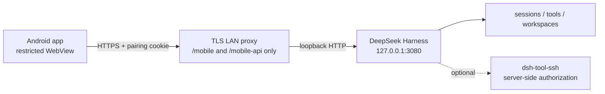

# DSH Mobile LAN

[简体中文](README.md) | English

Bring a restricted [DeepSeek Harness](https://github.com/deepseek-ai/deepseek-harness) chat surface to an Android phone on the same trusted LAN. Pair by scanning a short-lived QR code, then select sessions, send prompts, follow live output, inspect tool activity, and manage queued messages without configuring SSH on the phone or exposing Harness to the Internet.

> [!IMPORTANT]
> This is a community project, not an official DeepSeek release. The current version is designed for **one operator, trusted phones, and a trusted private network**. Do not expose port 3080, the TLS proxy, or `/mobile-api` to the public Internet.

<p align="center">
  
  
</p>

## Features

- Short-lived, single-use QR pairing generated only on the computer's loopback page.
- The 3080 Settings sidebar can generate and refresh the one-time QR directly; it withholds unusable QR codes while the LAN TLS proxy is not listening.
- Up-to-seven-day HttpOnly device session, revoked early on logout or Harness restart.
- Session drawer, workspace grouping, optional desktop-session visibility, and a default workspace selector; swipe right across chat content to open it and left inside the drawer to close it, search Chinese or English message content and workspace names/paths, or sort by newest, oldest, or title.
- Installing the mobile bundle opts the Harness SQLite content index in on first search. The derived index stays in memory and does not create another durable transcript database.
- Long-press a drawer session to rename it, fork its latest complete state, or archive it. Archiving hides the ordinary list entry while preserving Harness logs and workspace files.
- GFM Markdown, tables, blockquotes, task lists, code blocks, compact links, message copy, and conversation forks.
- Multimodal image messages from the `+` menu: PNG/JPEG/WebP/GIF preview, removal, image-only prompts, and historical image rendering; the plugin reads Harness 0.1.1's exact `inputModalities` route and sends images only to models that declare `image` input.
- Animation-frame live responses, reasoning, context injections, and collapsible tool/command timelines.
- Message actions stay collapsed until a completed message is tapped; reasoning and streaming output do not automatically show copy controls.
- Sending/delivered feedback, model work phases, elapsed processing time, completion notifications, and approval reminders.
- Harness `turn/end.reason` outcomes distinguish completion, cancellation, output limits, and failures; failures remain visible as a persistent turn card with the concrete reason.
- Structured `ask_user_question` answers, Plan review, tool approvals, and live queue-state convergence after mutations.
- Running-turn queue editing, deletion, single-message steering, and steer-all.
- Permission preset, agent preset, model, and reasoning-effort controls.
- Light, dark, and system appearance modes.
- Optional SSH tool with server-side aliases, host-key pinning, exact command allowlists, and workdir allowlists.

## Architecture and trust boundary



- Harness remains bound to `127.0.0.1`. Do not use `--host 0.0.0.0` or `--trusted-host`.
- The TLS proxy rejects the desktop root UI, `/api`, unsupported methods, and WebSocket upgrades.
- `/mobile-pair` accepts only a loopback Host. The QR code never contains the long-lived environment secret.
- Android receives the current TLS leaf certificate SHA-256 fingerprint through the one-time QR, accepts only an exact pin match, and still verifies certificate validity and the IP/DNS SAN. It does not modify the phone's global CA store.
- The WebView allows only `/mobile/` and `/mobile-api/` on the paired HTTPS origin.
- SSH credentials stay on the computer. The phone can request only aliases authorized by both plugins.

Read [the repository security policy](SECURITY.md), [the mobile plugin threat model](plugin/SECURITY.zh.md), and [the optional SSH threat model](optional/dsh-tool-ssh/SECURITY.zh.md).

## Repository layout

| Path | Purpose |
| --- | --- |
| `plugin/` | `dsh-mobile-remote` Cordis plugin, PWA, TLS proxy, and 56 smoke tests. |
| `android/` | Android 1.8 QR launcher, certificate pinning, system image picker, and restricted WebView client. |
| `optional/dsh-tool-ssh/` | Optional SSH tool and 21 loopback SSH tests. |
| `docs/branding/` | App icon source, generated master, and launcher-mask preview. |
| `scripts/setup-local-tls.ps1` | Creates the CA once, then reuses it while refreshing the current server identity. |
| `scripts/start-mobile-lan.ps1` | Starts/monitors Harness and the TLS proxy and follows the physical LAN IPv4. |
| `scripts/install.ps1` | Guided Windows setup: creates the secret, installs the plugin, registers per-user logon startup, and starts monitoring. |
| `scripts/generate-app-icons.py` | Regenerates the Android and PWA icon sets from the source artwork. |
| `scripts/verify.ps1` | Runs the JavaScript, dependency, SSH, Android, and lint checks. |

## Requirements

- Windows 10/11 and PowerShell 7.
- A working `dsh web` installation.
- Node.js 20 or later and npm.
- Installing a prepared APK does not require Android Studio; source builds require Android SDK 37 and JDK 11 or later.
- Computer and Android phone on the same trusted LAN.
- Android developer mode and USB debugging for installation only.

## Quick start (Windows)

### 1. Prepare the computer

```powershell
git clone https://github.com/zhishen-zhao/dsh-mobile-lan.git
cd dsh-mobile-lan
.\scripts\install.ps1
```

The installer creates and stores a high-entropy pairing secret, installs the local package through the official `dsh plugin --profile web add` command, registers the per-user `DSH Mobile LAN` logon task, and starts LAN monitoring. It never writes the pairing secret or private keys into the repository.

Restart a currently running Harness **once** so it receives the environment secret and browser plugin. If another program owns the Harness lifecycle, use `./scripts/install.ps1 -DoNotStartHarness`. Allow Node.js through Windows Firewall only on trusted **private** networks.

### 2. Install Android

The generic APK contains no computer CA or private key. The app pins the exact SHA-256 leaf fingerprint delivered by the QR, so one APK can pair with different installations. When a release APK is available, install it directly. To build from source:

```powershell
$env:JAVA_HOME = 'C:\Program Files\Android\Android Studio\jbr'
$env:ANDROID_HOME = "$env:LOCALAPPDATA\Android\Sdk"
cd android
.\gradlew.bat testDebugUnitTest lintDebug assembleDebug
```

The debug APK is `android/app/build/outputs/apk/debug/app-debug.apk`.

### 3. Pair

1. Open `http://127.0.0.1:3080` on the computer and choose **Settings → Mobile**.
2. Confirm that the LAN proxy is ready, then scan the one-time QR in the app.
3. The QR carries a short-lived pairing code and the current public certificate fingerprint, never the long-lived secret or a private key.
4. Restarts on the same address reuse the certificate. If the LAN IP or certificate changes, refresh and rescan; reinstalling the APK is unnecessary.
5. The same Settings page lists paired devices and their last activity and can revoke them individually.

### Manual startup and advanced configuration

Without the logon task, run `./scripts/start-mobile-lan.ps1`, or add `-DoNotStartHarness` when another process manages Harness. Defaults use `DSH_MOBILE_PAIRING_TOKEN` and `$HOME/.dsh/mobile-endpoint.json`; session scope, workspace allowlists, and SSH aliases remain optional profile overrides. Pairing secrets, TLS origins, and credentials are never editable from the phone.

## Optional SSH support

```powershell
cd optional\dsh-tool-ssh
npm ci
cd ..\..
dsh plugin --profile web add link:.\optional\dsh-tool-ssh
```

Follow the [SSH plugin documentation](optional/dsh-tool-ssh/README.md) to configure a low-privilege account, independently verified host-key fingerprint, exact command allowlist, and workdir allowlist. Then add only the required aliases to `mobile-remote.config.sshAliases`.

Avoid `allowUnrestrictedCommands` unless you explicitly accept arbitrary shell execution within the remote account's privileges.

## Important settings

| Setting | Safe default | Meaning |
| --- | --- | --- |
| `accessTokenEnv` | unset | Must name an environment variable containing at least 32 random bytes. |
| `pairingServerUrl` | unset | Exact HTTPS origin used by the phone; the certificate SAN must match. |
| `pairingServerUrlFile` | unset | Dynamic HTTPS endpoint state, read on every pairing-page refresh before the static fallback. |
| `allowExistingSessions` | `false` | `true` exposes existing desktop sessions to the paired phone. |
| `workspaceIds` | `[]` | Empty allows all registered workspaces; explicit IDs narrow the scope. |
| `sshAliases` | `[]` | Empty disables mobile SSH in both UI and server authorization. |
| `sessionTtlMs` | 7 days | Allowed range is five minutes to seven days; restart revokes it early. |
| `requireSecureTransport` | `true` | Keep enabled. HTTP would expose prompts, cookies, and tool output. |

## Troubleshooting

### TLS validation fails after pairing

- Confirm that `scripts/start-mobile-lan.ps1` is running and has printed `Ready` for the current address.
- Refresh the pairing page and confirm the address under the QR matches the physical LAN IPv4.
- An IP change does not require reinstalling the app. Rebuild and reinstall only after intentionally rotating the CA.
- Never ignore WebView certificate errors or downgrade the proxy to HTTP.

### The phone cannot reach the computer

- Both devices must be on the same LAN. Guest Wi-Fi client isolation blocks this design.
- Set Windows networking to Private and allow Node.js only on that private network.
- Verify that the TLS proxy listens on the current LAN address while Harness remains on `127.0.0.1:3080`.

### The plugin disappears after a Harness update

- Run `dsh plugin --profile web add link:.\plugin` again.
- Check that the profile patch still contains the `mobile-remote` override.
- Restart `dsh web`, then revisit `/mobile-pair` on localhost.

## Development and verification

```powershell
$env:JAVA_HOME = 'C:\Program Files\Android\Android Studio\jbr'
$env:Path = "$env:JAVA_HOME\bin;$env:Path"
.\scripts\verify.ps1
```

Current verified baseline:

- `dsh-mobile-remote 0.11.0`: 56 smoke checks covering 3080 Settings pairing and device management, TLS certificate pins, proxy readiness, Harness 0.1.1 image capability gating, turn-failure feedback, interaction responses, optimistic queue updates, session management, and message-content search.
- `dsh-tool-ssh 0.2.1`: 21 loopback SSH checks, compatible with `@deepseek-ai/dsh-* 0.1.1-rc.2`.
- Production npm dependency audits: zero known vulnerabilities.
- Android: `testDebugUnitTest`, `lintDebug`, and `assembleDebug` pass.

## Known limitations

- Single-user trusted-LAN design only; no Internet relay, tenancy, roles, or cross-device audit attribution.
- Android Keystore protects the device session at rest, but a person holding an unlocked phone can still use the app.
- `allowExistingSessions: true` broadens the phone's visibility.
- The Android build is bound to the computer CA and must be rebuilt after CA replacement.
- No native iOS client yet.

## License

[MIT](LICENSE)

The icon source artwork was generated with ChatGPT's image-generation feature and selected by the project maintainer. This is not an official DeepSeek, OpenAI, or ChatGPT project. See the [artwork, trademark, and removal notice](NOTICE.md) for rights information and the process for reasonably verifiable attribution, replacement, or removal requests.
