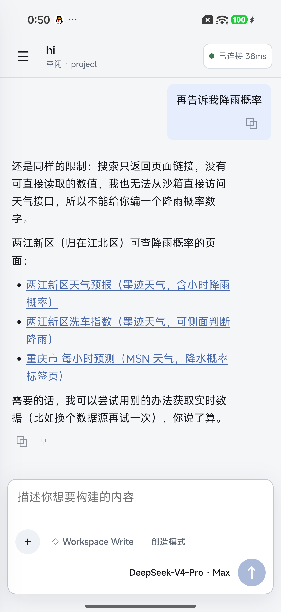
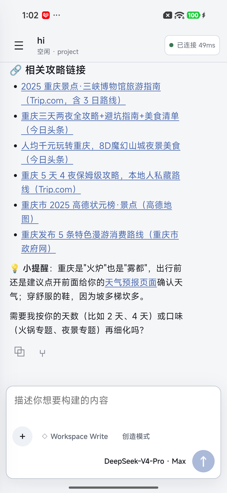
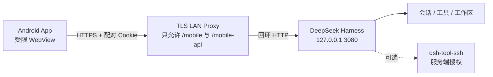

# DSH Mobile LAN

简体中文 | [English](README.en.md)

把本机 [DeepSeek Harness](https://github.com/deepseek-ai/deepseek-harness) 的受限聊天界面安全带到 Android 手机。电脑和手机处于同一可信局域网时，扫码即可选择会话、发送任务、查看实时输出和处理队列；不需要在手机配置 SSH，也不需要把 Harness 监听到公网。

> [!IMPORTANT]
> 这是社区项目，并非 DeepSeek 官方发行版。当前版本只面向**单一用户、可信手机、可信局域网**。不要把端口 3080、TLS 代理或 `/mobile-api` 暴露到互联网。

<p align="center">
  
  
</p>

## 主要功能

- 本机页面生成短时、一次性二维码，Android App 扫码配对。
- HttpOnly Cookie 设备会话，最长 7 天；主动断开或 Harness 重启会提前失效。
- 会话侧边栏、工作区分组、桌面任务同步开关和默认工作区选择。
- Markdown、代码、链接缩略、复制消息和新对话分支。
- 实时回答、工具/命令时间线、任务完成通知和待批准操作提醒。
- 运行中消息队列：编辑、删除、单条插话和全部插话。
- 权限预设、Agent 模式、模型与推理强度选择。
- 浅色、深色和跟随系统主题。
- 可选 SSH 工具：主机别名、主机指纹、精确命令和工作目录白名单。

## 架构与安全边界



- Harness 始终保持默认的 `127.0.0.1` 监听；不要使用 `--host 0.0.0.0` 或 `--trusted-host`。
- TLS 代理直接拒绝桌面根页面、`/api`、WebSocket Upgrade 和非移动端路径。
- 配对页只允许电脑回环 Host 访问；二维码不包含长期环境变量密钥。
- Android 只信任本次安装生成的本地 CA，并继续校验证书 SAN；不会忽略 TLS 错误。
- App WebView 只允许当前 HTTPS 源下的 `/mobile/` 与 `/mobile-api/`。
- SSH 私钥、密码和主机配置只保留在电脑；手机只能请求服务端明确允许的别名。

完整说明见 [安全策略](SECURITY.md)、[移动插件威胁模型](plugin/SECURITY.zh.md) 和 [SSH 威胁模型](optional/dsh-tool-ssh/SECURITY.zh.md)。

## 仓库结构

| 路径 | 内容 |
| --- | --- |
| `plugin/` | `dsh-mobile-remote` Cordis 插件、PWA、TLS 代理和 38 项 smoke 测试。 |
| `android/` | Android 1.6 原生扫码启动器和受限 WebView。 |
| `optional/dsh-tool-ssh/` | 可选 SSH 工具插件及 21 项回环 SSH 测试。 |
| `docs/branding/` | App 图标源文件、生成结果与圆形/自适应遮罩预览。 |
| `scripts/setup-local-tls.ps1` | 为当前安装生成 CA、服务证书、私钥并注入 Android 资源。 |
| `scripts/generate-app-icons.py` | 从图标源文件重新生成 Android 与 PWA 全套尺寸。 |
| `scripts/verify.ps1` | 运行插件、SSH 和 Android 的完整验证。 |

## 环境要求

- Windows 10/11 与 PowerShell 7。
- 已安装并能运行 `dsh web`。
- Node.js 20 或更新版本，npm 可用。
- Android Studio，Android SDK 37，JDK 11 或更新版本。
- 电脑与 Android 手机连接同一可信局域网。
- 手机已开启开发者模式和 USB 调试，仅构建安装时需要。

## 快速开始

### 1. 克隆并安装插件依赖

```powershell
git clone https://github.com/zhishen-zhao/dsh-mobile-lan.git
cd dsh-mobile-lan

cd plugin
npm ci
cd ..
```

### 2. 为配对根密钥设置环境变量

生成至少 32 字节随机值。不要把输出写入仓库、YAML、截图或二维码：

```powershell
$bytes = New-Object byte[] 32
[Security.Cryptography.RandomNumberGenerator]::Create().GetBytes($bytes)
$token = [Convert]::ToBase64String($bytes)
setx DSH_MOBILE_PAIRING_TOKEN $token
```

`setx` 只影响之后启动的进程。关闭并重新打开运行 Harness 的终端。

### 3. 确定电脑局域网地址并生成 TLS 材料

查看电脑当前 IPv4：

```powershell
Get-NetIPAddress -AddressFamily IPv4 |
  Where-Object { $_.AddressState -eq 'Preferred' -and -not $_.IPAddress.StartsWith('127.') }
```

假设手机访问地址为 `192.168.1.10`：

```powershell
.\scripts\setup-local-tls.ps1 -HostName 192.168.1.10
```

脚本会生成：

- `certs/server-cert.pem`：TLS 服务证书。
- `certs/server-key.pem`：TLS 私钥。
- `certs/ca-cert.pem` 与 `certs/ca-key.pem`：本次安装的 CA。
- `android/app/src/main/res/raw/dsh_mobile_local_ca.pem`：仅含公钥证书，供 App 固定信任。

以上路径均被 `.gitignore` 排除。每位使用者必须生成自己的证书；因此仓库不提供通用 APK。

### 4. 安装移动插件

在仓库根目录运行：

```powershell
dsh plugin --profile web add link:.\plugin
```

在 `$DSH_HOME/profiles/web/cordis.patch.yml` 中覆盖配置：

```yaml
- id: mobile-remote
  config:
    accessTokenEnv: DSH_MOBILE_PAIRING_TOKEN
    title: 'DSH 远程控制'
    pairingServerUrl: 'https://192.168.1.10:3080'
    localPairingQrTtlMs: 300000

    # 默认只允许手机创建的会话；需要同步桌面任务时才改为 true。
    allowExistingSessions: false

    # 空数组表示已配对的单一用户可选择所有已登记工作区。
    workspaceIds: []
    allowWorkspaceSelection: true

    # 空数组会隐藏并禁用手机 SSH。
    sshAliases: []

    maxHistoryMessages: 80
    maxPromptBytes: 8192
    maxSshTimeoutMs: 300000
    sessionTtlMs: 604800000
    requireSecureTransport: true
```

### 5. 启动 Harness 和局域网 TLS 代理

终端一：

```powershell
dsh web
```

终端二：

```powershell
node .\plugin\scripts\lan-proxy.mjs 3080 192.168.1.10 3080 `
  --tls-cert .\certs\server-cert.pem `
  --tls-key .\certs\server-key.pem
```

Windows 防火墙询问时，只允许受信任的“专用网络”。

### 6. 构建并安装 Android App

证书生成后再构建，因为 App 会把本次安装的 CA 固定进 APK：

```powershell
$env:JAVA_HOME = 'C:\Program Files\Android\Android Studio\jbr'
$env:Path = "$env:JAVA_HOME\bin;$env:Path"

cd android
.\gradlew.bat testDebugUnitTest lintDebug assembleDebug

$adb = "$env:LOCALAPPDATA\Android\Sdk\platform-tools\adb.exe"
& $adb install -r .\app\build\outputs\apk\debug\app-debug.apk
cd ..
```

也可以在 Android Studio 打开 `android/` 后点击 Run。

### 7. 扫码配对

1. 在电脑本机浏览器打开 `http://127.0.0.1:3080/mobile-pair`。
2. 打开 Android App，允许相机权限并扫描二维码。
3. App 先用一次性码换取设备 Cookie，再加载受限移动页面。
4. 如更换电脑 IP、DNS 名或重新生成 CA，需要重新构建并覆盖安装 App。

## 可选：启用 SSH

安装可选插件：

```powershell
cd optional\dsh-tool-ssh
npm ci
cd ..\..
dsh plugin --profile web add link:.\optional\dsh-tool-ssh
```

SSH 插件默认禁用且没有主机。请按其[中文说明](optional/dsh-tool-ssh/README.zh.md)配置主机指纹、低权限账号、精确命令白名单和工作目录白名单，然后把允许手机使用的别名加入 `mobile-remote.config.sshAliases`。不要启用 `allowUnrestrictedCommands`，除非你明确接受任意远程 Shell 的风险。

## 配置重点

| 配置 | 安全默认值 | 说明 |
| --- | --- | --- |
| `accessTokenEnv` | 无 | 必须指向至少 32 字节随机密钥的环境变量。 |
| `pairingServerUrl` | 无 | 手机实际访问的 HTTPS 根地址，证书 SAN 必须匹配。 |
| `allowExistingSessions` | `false` | `true` 会让手机看到桌面现有任务。 |
| `workspaceIds` | `[]` | 空数组允许选择全部 Harness 工作区；填写 ID 可进一步限制。 |
| `sshAliases` | `[]` | 空数组同时在界面和服务端禁用手机 SSH。 |
| `sessionTtlMs` | 7 天 | 范围 5 分钟至 7 天，Harness 重启会提前失效。 |
| `requireSecureTransport` | `true` | 不应关闭；HTTP 会泄露任务、Cookie 和工具输出。 |

## 常见问题

### 配对后提示 TLS 失败

- 确认 `pairingServerUrl` 与证书 SAN 完全相同。
- IP 改变后重新运行 TLS 脚本、重新构建并覆盖安装 App。
- 不要在 WebView 中忽略证书错误，也不要把代理降级为 HTTP。

### 手机无法连接电脑

- 手机和电脑必须在同一局域网，访客 Wi-Fi 的客户端隔离会阻断访问。
- 检查 Windows 网络类型是否为“专用”，并确认只在专用网络放行 Node.js。
- 确认 TLS 代理监听的是当前 LAN IP，而 Harness 仍监听 `127.0.0.1:3080`。

### Harness 更新后插件没有加载

- 重新执行 `dsh plugin --profile web add link:.\plugin`。
- 检查 profile 的 `cordis.patch.yml` 是否仍包含 `mobile-remote` 配置。
- 重启 `dsh web`，再查看 `/mobile-pair`。

### 为什么不发布 APK

APK 内固定信任每位使用者自己的 CA。发布一个通用 APK 要么无法连接你的证书，要么必须放宽 TLS 信任，都会破坏当前安全设计。

## 开发与验证

完整验证：

```powershell
$env:JAVA_HOME = 'C:\Program Files\Android\Android Studio\jbr'
$env:Path = "$env:JAVA_HOME\bin;$env:Path"
.\scripts\verify.ps1
```

当前基线：

- `dsh-mobile-remote 0.7.3`：38 项 smoke 测试。
- `dsh-tool-ssh 0.2.0`：21 项回环 SSH 测试。
- 两个 npm 生产依赖审计：0 个已知漏洞。
- Android：`testDebugUnitTest`、`lintDebug`、`assembleDebug`。

## 已知限制

- 只适用于单用户和可信局域网，不提供公网中继、多租户、角色权限或跨设备审计归属。
- 设备 Cookie 保存在 Android Keystore 中，但手机解锁期间持有手机的人仍可操作 App。
- `allowExistingSessions: true` 会扩大手机可见范围。
- Android App 与电脑 CA 绑定；更换 CA 后必须重新构建。
- 当前不支持 iOS 原生客户端。

## License

[MIT](LICENSE)

图标原始图由 ChatGPT 图像生成功能产出并由项目维护者选定。本项目并非 DeepSeek、OpenAI 或 ChatGPT 官方项目；商标与图像权利以及版权/商标异议处理方式见[图像、商标与移除声明](NOTICE.md)。经合理核验的权利人请求，相关内容可注明来源、替换或删除。
