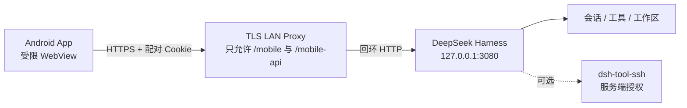

# DSH Mobile LAN

简体中文 | [English](README.en.md)

把本机 [DeepSeek Harness](https://github.com/deepseek-ai/deepseek-harness) 的受限聊天界面安全带到 Android 手机。电脑和手机处于同一可信局域网时，扫码即可选择会话、发送任务、查看实时输出和处理队列；不需要在手机配置 SSH，也不需要把 Harness 监听到公网。

> [!IMPORTANT]
> 这是社区项目，并非 DeepSeek 官方发行版。当前版本只面向**单一用户、可信手机、可信局域网**。不要把端口 3080、TLS 代理或 `/mobile-api` 暴露到互联网。

<p align="center">
  
  
</p>

## 主要功能

- 本机页面生成短时、一次性二维码，Android App 扫码配对。
- 3080 设置侧栏可直接生成并刷新一次性二维码；局域网 TLS 代理未监听时不再展示无效二维码。
- HttpOnly Cookie 设备会话，最长 7 天；主动断开或 Harness 重启会提前失效。
- 会话侧边栏、工作区分组、桌面任务同步开关和默认工作区选择；在聊天内容区右滑打开侧栏、在侧栏内左滑关闭，支持中英文会话正文搜索、工作区名称/路径搜索及最近/最早/名称排序。
- 安装移动插件后，Harness 的 SQLite 会话正文索引会在第一次搜索时按需启用；索引保存在内存中，不额外持久化一份聊天数据库。
- 长按侧栏会话可重命名、从最新完整状态创建分支或归档；归档只隐藏普通列表，保留 Harness 原始记录和工作区文件。
- GFM Markdown、表格、引用、任务列表、代码块、链接缩略、复制消息和新对话分支。
- 多模态图片消息：从 `+` 菜单选择 PNG/JPEG/WebP/GIF，支持预览、移除、仅图片发送和历史图片回显；插件会读取 Harness 0.1.1 的精确模型 `inputModalities`，只向声明支持 `image` 的模型发送图片。
- 按动画帧刷新的实时回答、思考过程、上下文注入、工具/命令时间线和任务完成通知。
- 消息操作默认收起，点击已完成消息后才显示复制/分支操作；思考过程和流式输出不会自动出现复制按钮。
- 发送中/已送达反馈、模型工作阶段、处理耗时和待批准操作提醒。
- 按 Harness `turn/end.reason` 区分完成、停止、输出上限和失败；失败时显示持久的“本轮运行失败”卡片与具体原因。
- `ask_user_question` 选项回答、Plan 审核、工具许可批准，以及提交后的实时状态收敛。
- 运行中消息队列：编辑、删除、单条插话和全部插话。
- 权限预设、Agent 模式、模型与推理强度选择。
- 浅色、深色和跟随系统主题。
- 可选 SSH 工具：主机别名、主机指纹、精确命令和工作目录白名单。

## 架构与安全边界



- Harness 始终保持默认的 `127.0.0.1` 监听；不要使用 `--host 0.0.0.0` 或 `--trusted-host`。
- TLS 代理直接拒绝桌面根页面、`/api`、WebSocket Upgrade 和非移动端路径。
- 配对页只允许电脑回环 Host 访问；二维码不包含长期环境变量密钥。
- Android 从一次性二维码取得当前 TLS 叶证书的 SHA-256 指纹，只对完全匹配的证书放行，并继续校验证书有效期与 IP/DNS SAN；不修改手机全局 CA。
- App WebView 只允许当前 HTTPS 源下的 `/mobile/` 与 `/mobile-api/`。
- SSH 私钥、密码和主机配置只保留在电脑；手机只能请求服务端明确允许的别名。

完整说明见 [安全策略](SECURITY.md)、[移动插件威胁模型](plugin/SECURITY.zh.md) 和 [SSH 威胁模型](optional/dsh-tool-ssh/SECURITY.zh.md)。

## 仓库结构

| 路径 | 内容 |
| --- | --- |
| `plugin/` | `dsh-mobile-remote` Cordis 插件、PWA、TLS 代理和 56 项 smoke 测试。 |
| `android/` | Android 1.8 原生扫码启动器、证书指纹绑定、系统图片选择器和受限 WebView。 |
| `optional/dsh-tool-ssh/` | 可选 SSH 工具插件及 21 项回环 SSH 测试。 |
| `docs/branding/` | App 图标源文件、生成结果与圆形/自适应遮罩预览。 |
| `scripts/setup-local-tls.ps1` | 首次生成 CA；以后复用 CA，仅为当前地址重签服务证书。 |
| `scripts/start-mobile-lan.ps1` | 启动/监控 Harness 和 TLS 代理，跟随物理局域网 IPv4。 |
| `scripts/install.ps1` | Windows 引导安装：生成密钥、安装插件、注册用户登录任务并启动局域网监控。 |
| `scripts/generate-app-icons.py` | 从图标源文件重新生成 Android 与 PWA 全套尺寸。 |
| `scripts/verify.ps1` | 运行插件、SSH 和 Android 的完整验证。 |

## 环境要求

- Windows 10/11 与 PowerShell 7。
- 已安装并能运行 `dsh web`。
- Node.js 20 或更新版本，npm 可用。
- 安装现成 APK 不需要 Android Studio；从源码构建才需要 Android SDK 37 和 JDK 11 或更新版本。
- 电脑与 Android 手机连接同一可信局域网。
- 手机已开启开发者模式和 USB 调试，仅构建安装时需要。

## 快速开始（Windows）

### 1. 一键准备电脑端

```powershell
git clone https://github.com/zhishen-zhao/dsh-mobile-lan.git
cd dsh-mobile-lan
.\scripts\install.ps1
```

安装脚本会生成并保存高熵配对密钥、通过官方 `dsh plugin --profile web add` 安装本地插件、注册当前用户登录时自动运行的 `DSH Mobile LAN` 任务，并启动地址监控。它不会把密钥或证书私钥写入仓库。

安装完成后，将正在运行的 Harness **重启一次**，使其读取新环境变量和浏览器插件。以后可直接运行 `dsh web`；登录任务会保持局域网 TLS 代理跟随当前物理 WLAN/以太网地址。若 Harness 由其他程序负责启动，可改用：

```powershell
.\scripts\install.ps1 -DoNotStartHarness
```

Windows 防火墙询问时，只允许受信任的“专用网络”。

### 2. 安装 Android App

通用 APK 不包含任何电脑的 CA 或私钥。App 会在扫码时绑定当前电脑证书的 SHA-256 指纹，因此同一 APK 可以用于不同用户。发布页提供 APK 后可直接安装；从源码构建使用：

```powershell
$env:JAVA_HOME = 'C:\Program Files\Android\Android Studio\jbr'
$env:ANDROID_HOME = "$env:LOCALAPPDATA\Android\Sdk"
cd android
.\gradlew.bat testDebugUnitTest lintDebug assembleDebug
```

调试 APK 位于 `android/app/build/outputs/apk/debug/app-debug.apk`。

### 3. 扫码配对

1. 在电脑打开 `http://127.0.0.1:3080`，进入“设置 → 手机端”。
2. 确认“局域网代理”为“已就绪”，然后在 App 中扫描一次性二维码。
3. 二维码同时携带短时配对码和当前公开证书指纹，不包含长期密钥或私钥。
4. 同一地址重启会复用服务证书；电脑 IP 或证书改变时刷新二维码并重新扫码，不需要重新安装 App。
5. “手机端”设置页可查看已配对设备及最后活动时间，并可逐台撤销。

### 手工启动与高级配置

不使用登录任务时，可以手工运行：

```powershell
.\scripts\start-mobile-lan.ps1
# Harness 已由其他程序管理：
.\scripts\start-mobile-lan.ps1 -DoNotStartHarness
```

默认配置已使用 `DSH_MOBILE_PAIRING_TOKEN` 和 `$HOME/.dsh/mobile-endpoint.json`。会话范围、工作区、SSH 别名等高级设置仍可通过 `$DSH_HOME/profiles/web/cordis.patch.yml` 覆盖；配对密钥、TLS 地址和凭据不会开放给手机修改。

## 可选：启用 SSH

安装可选插件：

```powershell
cd optional\dsh-tool-ssh
npm ci
cd ..\..
dsh plugin --profile web add link:.\optional\dsh-tool-ssh
```

SSH 插件默认禁用且没有主机。请按其[中文说明](optional/dsh-tool-ssh/README.zh.md)配置主机指纹、低权限账号、精确命令白名单和工作目录白名单，然后把允许手机使用的别名加入 `mobile-remote.config.sshAliases`。不要启用 `allowUnrestrictedCommands`，除非你明确接受任意远程 Shell 的风险。

## 配置重点

| 配置 | 安全默认值 | 说明 |
| --- | --- | --- |
| `accessTokenEnv` | 无 | 必须指向至少 32 字节随机密钥的环境变量。 |
| `pairingServerUrl` | 无 | 手机实际访问的 HTTPS 根地址，证书 SAN 必须匹配。 |
| `pairingServerUrlFile` | 无 | 动态 HTTPS 地址状态文件；刷新配对页时读取，优先于静态地址。 |
| `allowExistingSessions` | `false` | `true` 会让手机看到桌面现有任务。 |
| `workspaceIds` | `[]` | 空数组允许选择全部 Harness 工作区；填写 ID 可进一步限制。 |
| `sshAliases` | `[]` | 空数组同时在界面和服务端禁用手机 SSH。 |
| `sessionTtlMs` | 7 天 | 范围 5 分钟至 7 天，Harness 重启会提前失效。 |
| `requireSecureTransport` | `true` | 不应关闭；HTTP 会泄露任务、Cookie 和工具输出。 |

## 常见问题

### 配对后提示 TLS 失败

- 确认 `scripts/start-mobile-lan.ps1` 正在运行并已显示当前地址的 `Ready`。
- 刷新配对页，确认二维码下方地址与电脑当前物理局域网 IPv4 相同。
- IP 改变不需要重装 App；若明确轮换了 CA，才重新构建并覆盖安装。
- 不要在 WebView 中忽略证书错误，也不要把代理降级为 HTTP。

### 手机无法连接电脑

- 手机和电脑必须在同一局域网，访客 Wi-Fi 的客户端隔离会阻断访问。
- 检查 Windows 网络类型是否为“专用”，并确认只在专用网络放行 Node.js。
- 确认 TLS 代理监听的是当前 LAN IP，而 Harness 仍监听 `127.0.0.1:3080`。

### Harness 更新后插件没有加载

- 重新执行 `dsh plugin --profile web add link:.\plugin`。
- 检查 profile 的 `cordis.patch.yml` 是否仍包含 `mobile-remote` 配置。
- 重启 `dsh web`，再查看 `/mobile-pair`。

### 为什么不发布 APK

APK 内固定信任每位使用者自己的 CA。发布一个通用 APK 要么无法连接你的证书，要么必须放宽 TLS 信任，都会破坏当前安全设计。

## 开发与验证

完整验证：

```powershell
$env:JAVA_HOME = 'C:\Program Files\Android\Android Studio\jbr'
$env:Path = "$env:JAVA_HOME\bin;$env:Path"
.\scripts\verify.ps1
```

当前基线：

- `dsh-mobile-remote 0.11.0`：56 项 smoke 测试；包含 3080 设置页配对与设备管理、TLS 证书指纹、代理就绪检查、Harness 0.1.1 图片能力门控、运行失败提示、交互回包、队列乐观更新、会话管理和消息内容搜索。
- `dsh-tool-ssh 0.2.1`：21 项回环 SSH 测试，兼容 `@deepseek-ai/dsh-* 0.1.1-rc.2`。
- 两个 npm 生产依赖审计：0 个已知漏洞。
- Android：`testDebugUnitTest`、`lintDebug`、`assembleDebug`。

## 已知限制

- 只适用于单用户和可信局域网，不提供公网中继、多租户、角色权限或跨设备审计归属。
- 设备 Cookie 保存在 Android Keystore 中，但手机解锁期间持有手机的人仍可操作 App。
- `allowExistingSessions: true` 会扩大手机可见范围。
- Android App 与电脑 CA 绑定；更换 CA 后必须重新构建。
- 当前不支持 iOS 原生客户端。

## License

[MIT](LICENSE)

图标原始图由 ChatGPT 图像生成功能产出并由项目维护者选定。本项目并非 DeepSeek、OpenAI 或 ChatGPT 官方项目；商标与图像权利以及版权/商标异议处理方式见[图像、商标与移除声明](NOTICE.md)。经合理核验的权利人请求，相关内容可注明来源、替换或删除。
